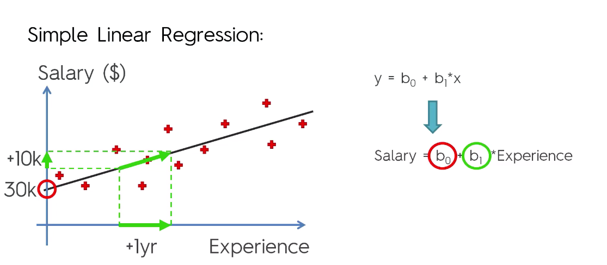

# Simple Linear Regression Model
One of the simplest Machine Learning model is the Linear Regression model.
In this model a linear dependance of one feature(Dependant variable) on other features(Independant variables) is found, a suitable and best fit regression line is chosen and the model is then tested for Test data.

In this model the data set consists of two columns(varibles), namely:
* Salary(Dependant variable)
* Experience(Independant variable)

## Procedure:
* First the data is  divided into two set - Training set(2/3 of the total observations) and Test set(1/3 of total observation)
* A regression line is plotted randomly such that it fits most of the points in the training set
* The best fit is decided on the basis of Euclidean's distance, which states that the distance between two points (x1,y1) and (x2,y2) in a 2D plane is 
`distance = [(x2-x1)^2 + (y2-y1)^2] ^1/2`
* The sum of all the distances is calculated (between the orignal point and the random regression line) and stored. The regression line with the minimum value is chosen as the best fit
* Then we plot the graph for Training set and Test set to visualize our output

## Outputs
### Salary vs Experience(Training set)

### Salary vs Experience(Test set)

